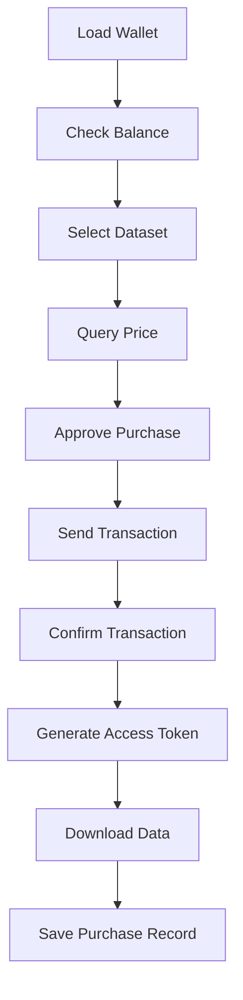

# Ocean Protocol Dataset Toolkit

A comprehensive toolkit for purchasing and downloading datasets from Ocean Protocol marketplace using automated scripts.

## 🌊 Features

- **Automated Dataset Purchase**: Complete workflow from wallet connection to data download
- **Multiple Purchase Options**: Simple downloader, API client, and full automated purchaser
- **Wallet Integration**: Support for keystore file-based wallet management
- **Environment Configuration**: Secure configuration using `.env` files
- **Sample Data Access**: Quick access to sample datasets for testing
- **Full Dataset Purchase**: Automated purchasing of complete datasets with OCEAN tokens

## 📁 Project Structure

```
ocean-protocol-toolkit/
├── ocean_dataset_purchaser.py      # Main automated purchase script
├── ocean_downloader.py             # Simple sample data downloader  
├── auto_ocean_purchaser.py         # Complete automated purchase system
├── team3-*.json                    # Wallet keystore file
├── .env                           # Environment configuration
├── requirements.txt               # Python dependencies
├── README.md                      # This file
├── downloads/                     # Sample data downloads
│   ├── enron_sample.csv
│   └── cameroon_sample.json
└── purchases/                     # Full dataset purchases
    ├── enron_full_dataset.csv
    ├── cameroon_full_dataset.json
    └── purchase_records.json
```

## 🚀 Quick Start

### 1. Installation

```bash
# Clone the repository
git clone https://github.com/assistonia/ocean_data_404.git
cd ocean_data_404

# Install dependencies
pip install -r requirements.txt
```

### 2. Environment Setup

Copy `.env.example` to `.env` and configure your settings:

```bash
cp .env .env.local
```

Edit `.env.local`:
```env
# Ocean Protocol Configuration
NETWORK_URL=https://mainnet.infura.io/v3/YOUR_INFURA_KEY
AQUARIUS_URL=https://v4.aquarius.oceanprotocol.com
PROVIDER_URL=https://v4.provider.oceanprotocol.com

# Wallet Configuration  
WALLET_KEYSTORE_PATH=team3-f89f413d855d86ec8ac7a26bbfb7aa49df290004.json
WALLET_PASSWORD=your_wallet_password_here
```

### 3. Usage Options

#### Option A: Sample Data Only (Free)
```bash
# Quick sample download
python ocean_downloader.py --quick

# Interactive mode
python ocean_downloader.py
```

#### Option B: Full Automated Purchase
```bash
# Complete automated purchase system
python auto_ocean_purchaser.py

# Ocean Protocol SDK-based purchaser (requires full setup)
python ocean_dataset_purchaser.py
```

## 📊 Supported Datasets

| Dataset | DID | Sample API | Price |
|---------|-----|------------|-------|
| **Enron Email Dataset** | `did:op:1beab...58dd` | [Sample API](https://e1k3lz2wcg.execute-api.us-west-2.amazonaws.com/data) | 0.1 OCEAN |
| **Cameroon Gazette** | `did:op:204e6...fe9c` | [Sample API](https://yjiuaiehxf.execute-api.us-west-2.amazonaws.com/data) | 0.05 OCEAN |

## 🔐 Wallet Configuration

### Keystore File Setup
1. Place your wallet keystore JSON file in the project directory
2. Update `WALLET_KEYSTORE_PATH` in `.env`
3. Set `WALLET_PASSWORD` (or leave empty for interactive prompt)

### Example Wallet Info
```json
{
  "address": "f89f413d855d86ec8ac7a26bbfb7aa49df290004",
  "id": "28d05911-9630-471a-97ab-ca3e31d40b06",
  "version": "3"
}
```

## 🛠️ Tools Overview

### 1. Simple Downloader (`ocean_downloader.py`)
- **Purpose**: Quick access to sample datasets
- **Features**: No wallet required, instant download, file analysis
- **Best for**: Testing, data exploration, development

### 2. Auto Purchaser (`auto_ocean_purchaser.py`) 
- **Purpose**: Complete purchase simulation
- **Features**: Wallet simulation, transaction generation, purchase records
- **Best for**: Understanding the purchase flow, development testing

### 3. SDK Purchaser (`ocean_dataset_purchaser.py`)
- **Purpose**: Real Ocean Protocol integration
- **Features**: Actual blockchain transactions, smart contract interaction
- **Best for**: Production use with real OCEAN tokens

## 🔄 Purchase Workflow



## 💡 Example Usage

### Quick Sample Download
```python
from ocean_downloader import SimpleOceanDownloader

downloader = SimpleOceanDownloader()
downloader.quick_download_all()
```

### Automated Purchase
```python
from auto_ocean_purchaser import AutomatedOceanPurchaser

purchaser = AutomatedOceanPurchaser()
purchaser.automated_purchase_workflow()
```

### Full SDK Integration
```python
from ocean_dataset_purchaser import OceanDatasetPurchaser

purchaser = OceanDatasetPurchaser()
purchaser.load_wallet_from_keystore("wallet.json")
purchaser.purchase_and_download("did:op:1beab...")
```

## 🔧 Configuration

### Network Options
- **Ethereum Mainnet**: Full OCEAN token support
- **Polygon Network**: Lower gas fees
- **Custom RPC**: Your own node

### Environment Variables
| Variable | Description | Default |
|----------|-------------|---------|
| `NETWORK_URL` | Blockchain RPC endpoint | Infura mainnet |
| `AQUARIUS_URL` | Ocean metadata service | v4.aquarius.oceanprotocol.com |
| `PROVIDER_URL` | Ocean data provider | v4.provider.oceanprotocol.com |
| `WALLET_KEYSTORE_PATH` | Path to wallet file | team3-*.json |
| `WALLET_PASSWORD` | Wallet password | (interactive prompt) |

## 🔒 Security Notes

1. **Never commit wallet files or passwords to git**
2. **Use environment variables for sensitive data**
3. **Test with small amounts first**
4. **Verify dataset authenticity before purchase**

## 🐛 Troubleshooting

### SDK Installation Issues
```bash
# If ocean-lib installation fails
pip install --upgrade pip setuptools wheel
pip install ocean-lib --no-cache-dir
```

### Wallet Loading Problems
- Verify keystore file format
- Check password accuracy
- Ensure sufficient OCEAN balance
- Confirm network connectivity

### Download Failures
- Check internet connection
- Verify access token validity
- Ensure sufficient disk space
- Try sample endpoints first

## 🤝 Contributing

1. Fork the repository
2. Create feature branch (`git checkout -b feature/amazing-feature`)
3. Commit changes (`git commit -m 'Add amazing feature'`)
4. Push to branch (`git push origin feature/amazing-feature`)
5. Open Pull Request

## 📜 License

This project is licensed under the MIT License - see the [LICENSE](LICENSE) file for details.

## 🙏 Acknowledgments

- [Ocean Protocol](https://oceanprotocol.com/) for the decentralized data marketplace
- [Enron Email Dataset](https://www.cs.cmu.edu/~./enron/) from CMU
- Sample datasets provided via Ocean Protocol marketplace

## 🔗 Links

- [Ocean Protocol Documentation](https://docs.oceanprotocol.com/)
- [Ocean Protocol SDK](https://github.com/oceanprotocol/ocean.py)
- [Dataset Explorer](https://market.oceanprotocol.com/)

---

**Made with 🌊 for Ocean Protocol Blockathon 2025**
